<a href="https://kanishkpaul.com">
  <picture>
    <source media="(prefers-color-scheme: dark)" srcset="./assets/profile-terminal-dark.svg" />
    <source media="(prefers-color-scheme: light)" srcset="./assets/profile-terminal-light.svg" />
    
  </picture>
</a>

<p align="center">
  <a href="https://kanishkpaul.com"><code>kanishkpaul.com</code></a>
  ·
  <a href="https://kanishkpaul.com/research"><code>research</code></a>
  ·
  <a href="mailto:kanishkpaul1729@gmail.com"><code>email</code></a>
  ·
<!-- profile-badges:start -->
  <a href="https://github.com/kanishkpaul"><code>18 followers</code></a> · <a href="https://github.com/kanishkpaul?tab=repositories"><code>18 public repos</code></a>
<!-- profile-badges:end -->
</p>

<table>
  <tr>
    <td width="156" align="center">
      <picture>
        <source media="(prefers-color-scheme: dark)" srcset="./assets/research-orbit-dark.svg" />
        <source media="(prefers-color-scheme: light)" srcset="./assets/research-orbit-light.svg" />
        
      </picture>
    </td>
    <td>
      <h3>Hey, I’m Kanishk.</h3>
      I build systems for <strong>reasoning, agents, multilingual NLP, and local inference</strong>. My favorite loop is simple:<br><br>
      <code>build → test → falsify → revise</code><br><br>
      I publish work when I can show inspectable evidence. I keep paper-critical mechanisms and datasets out of the public repos until they are ready for formal release.
    </td>
  </tr>
</table>

## `~/research`

I do independent research and publish the failures too. What I put here is backed by inspectable evidence, runnable infrastructure, and explicit limitations.

| state | project | public signal |
| :---: | --- | --- |
| `MEASURED` | [register-obstruction](https://github.com/kanishkpaul/register-obstruction) | I measured honorific-register loss across direct and English-pivot Bengali→Hindi translation. My preregistered predictor did not survive robustness analysis; the measurement result remains. |
| `RUNNABLE` | [arc-agi3-world-models](https://github.com/kanishkpaul/arc-agi3-world-models) | I built a world-model agent substrate for hidden-rule induction, uncertainty probing, and planning. |
| `BENCHED` | [butterflygate](https://github.com/kanishkpaul/butterflygate) | I benchmarked a sub-quadratic attention alternative. I am keeping the unpublished mechanism private. |

> **Disclosure boundary:** I keep item-level analysis, frozen datasets, and unpublished mechanisms private until the papers are ready.

## `~/build`

I build tools that make model behavior more local, visible, and inspectable.

<!-- pinned-projects:start -->
| project | what I built | signals |
| --- | --- | --- |
| [sefai](https://github.com/kanishkpaul/sefai) | My Rust CLI for running local GGUF models through llama.cpp bindings inside a controlled environment | `Rust` &middot; `2 stars` |
| [chromeclaw](https://github.com/kanishkpaul/chromeclaw) | My terminal-first browser agent with visible traces, explicit safety gates, and a small eval loop | `TypeScript` &middot; `2 stars` |
| [reasontrace](https://github.com/kanishkpaul/reasontrace) | My visual debugger for turning agent logs into an inspectable graph with replay | `TypeScript` &middot; `1 star` |
| [casca](https://github.com/kanishkpaul/casca) | My screenshot-grounded desktop-agent scaffold for visual grounding and action-reliability research | `Python` &middot; `1 star` |
| [stockfih](https://github.com/kanishkpaul/stockfih) | My chess-analysis interface pairing browser-side Stockfish with short natural-language coaching | `TypeScript` &middot; `1 star` |
<!-- pinned-projects:end -->

## `~/operating-principles`

```text
[01] evidence before rhetoric
[02] structure before scale
[03] negative results are still results
[04] local and inspectable beats magical and opaque
```

<details>
<summary><code>~/telemetry — live repository totals</code></summary>

<!-- stats-badges:start -->
<pre>
lines.added       5,490,888
lines.removed        61,269
commits.counted         490
stars.received           16
followers                18
following                 6
public.repos             18
</pre>
<!-- stats-badges:end -->

</details>

<details>
<summary><code>~/activity — contribution signal</code></summary>

<picture>
  <source media="(prefers-color-scheme: dark)" srcset="https://raw.githubusercontent.com/kanishkpaul/kanishkpaul/output/github-snake-dark.svg" />
  <source media="(prefers-color-scheme: light)" srcset="https://raw.githubusercontent.com/kanishkpaul/kanishkpaul/output/github-snake.svg" />
  
</picture>

</details>

## `~/contact`

I like talking to people working on reasoning, agents, multilingual evaluation, local models, and research questions strange enough to be useful. If that sounds like you, email me.

<p align="center">
  <a href="mailto:kanishkpaul1729@gmail.com"><code>email</code></a>
  ·
  <a href="https://kanishkpaul.com"><code>web</code></a>
  ·
  <a href="https://www.linkedin.com/in/kanishk-paul"><code>linkedin</code></a>
</p>
